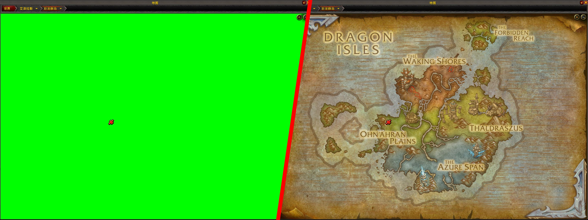

# Degreen World Map

Temporary workaround until world map localization is complete.

## Usage

Install as an addon.

Note: this addon works by adding translated map tiles (简体中文 and 繁體中文) or enUS map tiles (other languages) to world map frame, and thus may conflict with Fog of War remover.

## How to Build

Install recent Python and [Pillow](https://pypi.org/project/pillow/), then run `./build.py`. The output is `DegreenWorldMap-<version>.zip`.
